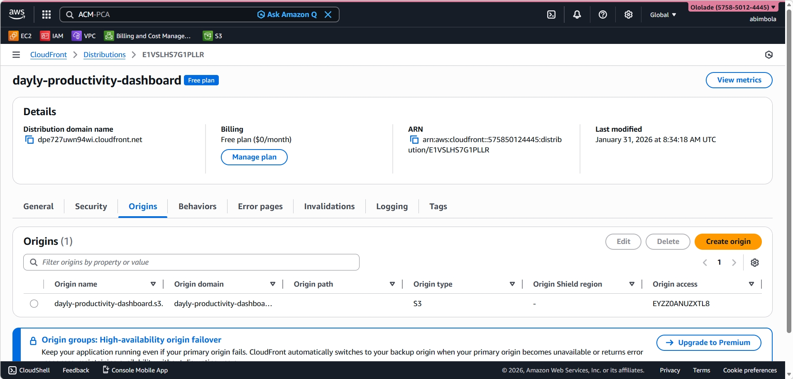

# Cloud-Hosted React Dashboard

## Overview
A responsive frontend dashboard built with React and deployed on AWS using a secure static hosting architecture.  
The project demonstrates real-world frontend deployment using Amazon S3 and CloudFront.

## 🌐 Live Demo
- CloudFront URL: https://dpe727uwn94wi.cloudfront.net/

## Tech Stack
**Frontend**
- Vite
- React
- Tailwind CSS
- shadcn/ui

**Cloud / DevOps**
- Amazon S3 (private bucket)
- Amazon CloudFront (CDN)
- Origin Access Control (OAC)
- CloudFront default HTTPS

**Tools**
- Git & GitHub
- VS Code
- AWS Management Console

##  AWS Architecture
User traffic is routed through Amazon CloudFront, which serves as the public entry point and CDN.  
CloudFront securely fetches static assets from a private S3 bucket using Origin Access Control (OAC).  
The application is served over HTTPS using CloudFront’s default certificate.

##  Features
- Responsive dashboard UI
- Secure static hosting on AWS
- CDN-backed content delivery
- Private S3 bucket (no public access)
- HTTPS enabled by default

##  CI/CD Pipeline (GitHub Actions)

This project uses **GitHub Actions** to automate deployment to AWS.

### How it works
On every push to the `main` branch:
1. GitHub Actions installs dependencies
2. Builds the React application using Vite
3. Uploads the production build (`dist/`) to the S3 bucket
4. Invalidates the CloudFront cache so updates are served immediately

### Benefits
- No manual uploads to S3
- Consistent and repeatable deployments
- Faster iteration on UI changes

##  Deployment
- Build frontend locally using Vite
- Upload production build (`dist/`) to Amazon S3
- Serve content through CloudFront
- CloudFront cache is invalidated automatically on each deployment

##  Screenshots

### AWS Architecture

### CloudFront Distribution

### CloudFront Origin Configuration

### S3 Bucket Permissions (Private)

### Live Application

##  Cost
This project runs within AWS Free Tier limits for S3 and CloudFront under light usage.  
No paid services were required during development.

##  Purpose
This project was built to practice:
- Deploying a frontend application on AWS
- Understanding CDN-based architectures
- Securing S3 using CloudFront OAC
- Documenting real cloud projects professionally

##  Future Improvements
- Add custom domain with ACM
- Improve caching policies
- Add backend API integration

## Author
Eleja Ololade
